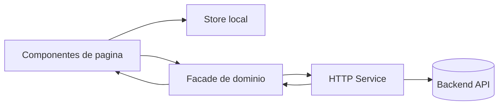

# Arquitectura del frontend

## Proposito

Este frontend Angular esta organizado para mantener la logica de pantalla separada de la logica de dominio y de acceso a API.

La regla general es simple:

- la UI decide que mostrar,
- los `stores` guardan estado transitorio,
- las `facades` exponen operaciones del dominio,
- los `services` hablan con HTTP,
- los `utils` encapsulan formateo y parseo reutilizable.

---

## Estructura por capas

```txt
app/
  core/
    utils/
  shared/
    pipes/
    ui-feedback/
  exercises/
  sessions/
  charts/
  calendar/
  home/
```

## Responsabilidad por carpeta

### `core/`

Funciones puras y helpers sin dependencias de UI.

Ejemplos:

- `date.utils.ts`
- `format.utils.ts`
- `number.utils.ts`
- `string.utils.ts`

### `shared/`

Piezas reutilizables de presentacion.

Ejemplos:

- `confirm-dialog.component.ts`
- `ui-feedback/ui-toast.store.ts`
- `pipes/`

### `exercises/`

Flujo completo del catalogo de ejercicios.

Incluye:

- listado,
- detalle,
- crear,
- editar,
- progreso,
- form store,
- facade,
- service.

### `sessions/`

Flujo completo de sesiones y entradas.

Incluye:

- alta de sesion,
- detalle de sesion,
- alta de ejercicios dentro de una sesion,
- modales,
- tablas de series,
- stores de formulario,
- facade,
- service.

### `charts/` y `calendar/`

Pantallas de consulta derivadas de las sesiones registradas.

---

## Flujo de datos



## Regla practica

Si algo cambia por interaccion del usuario y solo vive en la pantalla, va a un store.

Si algo representa una operacion de dominio, va a una facade.

Si algo solo transforma datos, va a `core/utils`.

---

## Convenciones de implementacion

1. Las paginas suelen ser `standalone components`.
2. Los formularios complejos se apoyan en stores dedicados.
3. Las pantallas no llaman al `HttpClient` directamente.
4. Los textos de formato se centralizan para evitar duplicacion.
5. Los componentes compartidos deben ser lo mas tontos posible.

---

## Puntos sensibles

- `app.routes.ts` define la entrada a cada pantalla.
- `app.config.ts` concentra providers globales.
- `shared/ui-feedback` gestiona mensajes temporales.
- `shared/pipes` evita repetir reglas de formato en templates.
